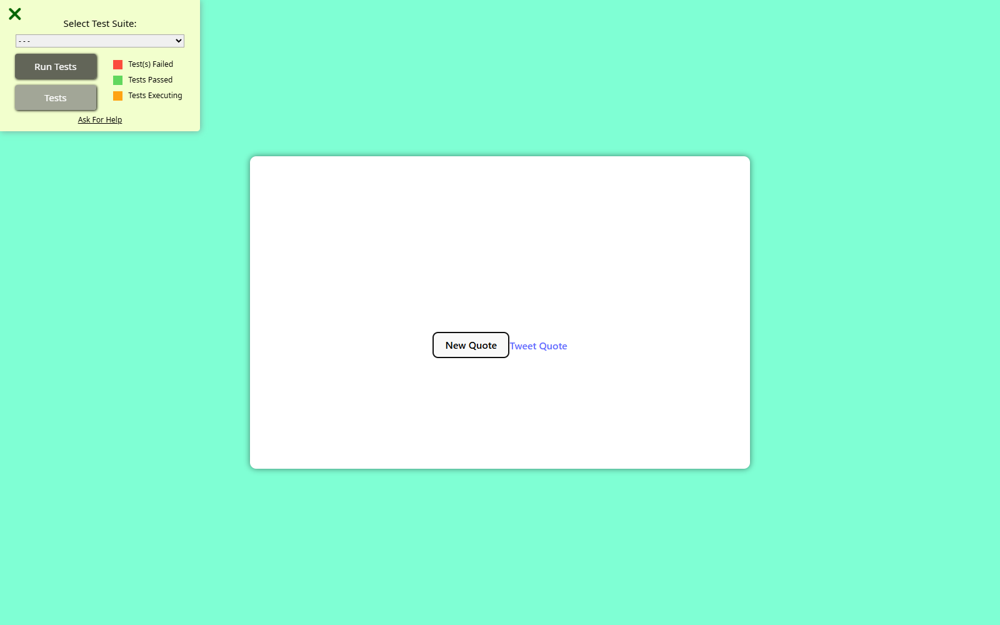

# Random Quote Machine

**A small React interface for fetching a new thought.**

A freeCodeCamp frontend learning project that requests a random quote from Quotable and displays its author. It focuses on API requests, component state, and a simple interactive card.



*Actual app during the October 6, 2026 check. The quote service could not be resolved, so the card stayed empty. No replacement quote was inserted for the screenshot.*

## What it does

The app requests a quote when it opens. **New Quote** sends another request and updates the quote and author when a response arrives.

| Control | Current behavior |
| --- | --- |
| New Quote | Request another quote from Quotable |
| Tweet Quote | An unfinished sharing link; see the limitations below |

There is no local quote collection, search, favorites, or saved history. The displayed writing comes from the external API.

## Run locally

```sh
git clone https://github.com/gradywasil/random-quote.git
cd random-quote
npm ci
npm run dev
```

Open the URL printed by Vite. An internet connection and a working Quotable endpoint are required to retrieve quotes. The repository includes a lockfile but does not pin a Node.js version.

| Command | Purpose |
| --- | --- |
| `npm run dev` | Start the development server |
| `npm run build` | Generate the production build |
| `npm run preview` | Serve the production build locally |
| `npm run lint` | Run the configured ESLint checks |

## Under the hood

| Piece | Responsibility |
| --- | --- |
| React 18 | Render the quote card and update component state |
| Fetch API | Request `https://api.quotable.io/random` |
| Quotable | Supply quote text and author data |
| Vite 4 | Development tooling and production bundling |
| CSS | Aquamarine background and rounded quote card |

The request helper reads the response's `content` and `author` fields. The component uses the same request flow for its initial load and the New Quote button.

## Current limitations

This is a 2023 learning project with a few unfinished details:

- **API failures are not explained in the interface.** There is no loading indicator or user-facing error message, so a failed initial request can leave an empty card.
- **Sharing is incomplete.** Tweet Quote uses a relative URL without the quote text or author. It does not currently provide a working social-sharing flow.
- **Requests are not sequenced or cancelled.** Repeated clicks can overlap requests.
- **Layout needs further testing.** The card uses fixed percentage dimensions; long quotes and narrow screens may need refinement.

There is no automated test script in `package.json`. The page loads the freeCodeCamp browser test bundle, which should not be treated as evidence of a current passing test run.

## Verification snapshot

Checked on October 6, 2026 with Node 24.9.0 and npm 11.6.0:

| Check | Result |
| --- | --- |
| Locked dependency install | Passed |
| Production build and lint | Passed |
| Initial quote and New Quote | Requests were made, but the API hostname failed to resolve in the test browser |
| Failure feedback | Quote and author stayed blank; no visible error message appeared |
| Populated quote rendering | Could not be verified while the service was unavailable |

The sharing link was inspected without posting. Its relative URL and missing quote parameters remain an implementation limitation.

## Credits

Created by [Grady Wasil](https://github.com/gradywasil) as a freeCodeCamp frontend learning exercise. Quotes are supplied by Quotable; React and Vite provide the application foundation.
